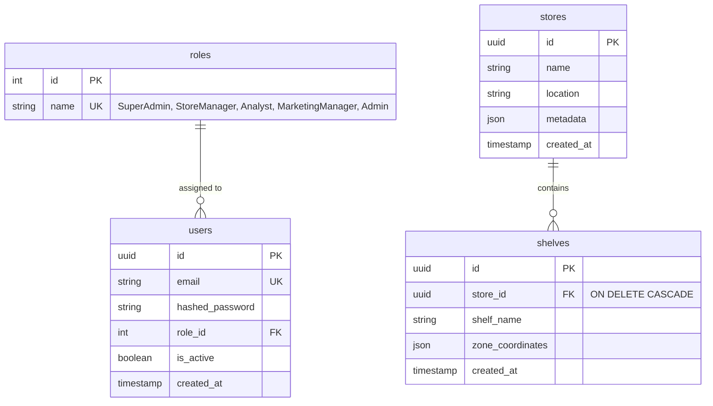

# Database Schema Entity-Relationship Diagram

This document contains the Entity-Relationship Diagram (ERD) describing the database schema for the Consumer Attention Mapping System.

## Description of Relations and Cardinalities

1. **`roles` to `users` (`1:N`)**:
   * A **Role** can be assigned to zero, one, or many **Users** (`||--o{`).
   * A **User** must have exactly one **Role** (`}o--||`).

2. **`stores` to `shelves` (`1:N` with Cascade Delete)**:
   * A **Store** can contain zero, one, or many **Shelves** (`||--o{`).
   * A **Shelf** must belong to exactly one **Store** (`}o--||`).
   * Deleting a **Store** automatically cascade-deletes all its associated **Shelves** in the database.
